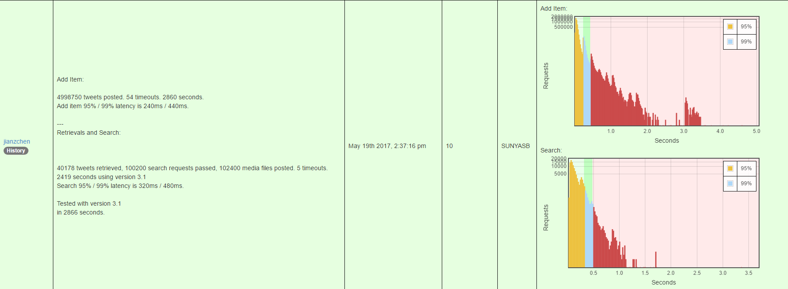

# twitter.com clone
## Technologies / Stack
* Laravel Framework
* MongoDB
* HAProxy
* Nginx

## BenchMark

## API
<html>
   <head>
      <meta content="text/html; charset=UTF-8" http-equiv="content-type">
   </head>
   <body class="c22 c30">
      

         
      

      

         
      

      
      
      <table class="c32">
         <tbody>
            <tr class="c8">
               <td class="c17" colspan="1" rowspan="1">
                  

                     Route
                  

               </td>
               <td class="c2" colspan="1" rowspan="1">
                  

                     Method
                  

               </td>
               <td class="c12" colspan="1" rowspan="1">
                  

                     Request Params
                  

                  

                     POST parameters are JSON (application/json)
                  

               </td>
               <td class="c19" colspan="1" rowspan="1">
                  

                     Description
                  

                  

                     All return types are JSON
                  

               </td>
            </tr>
            <tr class="c34">
               <td class="c17 c22" colspan="1" rowspan="1">
                  

                     /adduser
                  

               </td>
               <td class="c2" colspan="1" rowspan="1">
                  

                     POST
                  

               </td>
               <td class="c12" colspan="1" rowspan="1">
                  <ul class="c4 lst-kix_t75zkrbghosd-0 start">
                     <li class="c3 c21">
                        username
                     </li>
                     <li class="c3 c21">
                        email
                     </li>
                     <li class="c3 c21">
                        password
                     </li>
                  </ul>
                  

                     
                  

               </td>
               <td class="c19" colspan="1" rowspan="1">
                  <ul class="c4 lst-kix_fe7suoya5wtb-0 start">
                     <li class="c3 c21">
                        Register new user account
                     </li>
                     <li class="c3 c21">
                        Username and email must be unique
                     </li>
                     <li class="c3 c21">
                        Should send email with verification key
                     </li>
                  </ul>
                  

                     
                  

                  <ul class="c4 lst-kix_fe7suoya5wtb-0">
                     <li class="c3 c21">
                        Returns:
                     </li>
                  </ul>
                  <ul class="c4 lst-kix_fe7suoya5wtb-1 start">
                     <li class="c6 c21">
                        status
                        : &ldquo;OK&rdquo; or &ldquo;error&rdquo;
                     </li>
                     <li class="c6 c21">
                        error:
                        &nbsp;error message (if error)
                     </li>
                  </ul>
                  

                     
                  

               </td>
            </tr>
            <tr class="c8">
               <td class="c17 c22" colspan="1" rowspan="1">
                  

                     /login
                  

               </td>
               <td class="c2" colspan="1" rowspan="1">
                  

                     POST
                  

               </td>
               <td class="c12" colspan="1" rowspan="1">
                  <ul class="c4 lst-kix_t75zkrbghosd-0">
                     <li class="c3">
                        username
                     </li>
                     <li class="c3">
                        password
                     </li>
                  </ul>
               </td>
               <td class="c19" colspan="1" rowspan="1">
                  <ul class="c4 lst-kix_la936x4rw1qp-0 start">
                     <li class="c3">
                        Login to account
                     </li>
                     <li class="c3">
                        Sets session cookie
                     </li>
                  </ul>
                  

                     
                  

                  <ul class="c4 lst-kix_l789lne2pxx2-0 start">
                     <li class="c3">
                        Returns:
                     </li>
                  </ul>
                  <ul class="c4 lst-kix_l789lne2pxx2-1 start">
                     <li class="c6">
                        status
                        : &ldquo;OK&rdquo; or &ldquo;error&rdquo;
                     </li>
                     <li class="c6">
                        error:
                        &nbsp;error message (if error)
                     </li>
                  </ul>
               </td>
            </tr>
            <tr class="c8">
               <td class="c17 c22" colspan="1" rowspan="1">
                  

                     /logout
                  

               </td>
               <td class="c2" colspan="1" rowspan="1">
                  

                     POST
                  

               </td>
               <td class="c12" colspan="1" rowspan="1">
                  

                     
                  

               </td>
               <td class="c19" colspan="1" rowspan="1">
                  <ul class="c4 lst-kix_3c985d66kqiq-0 start">
                     <li class="c3">
                        Logout of account
                     </li>
                  </ul>
                  

                     
                  

                  <ul class="c4 lst-kix_n9ij0kz5ap2c-0 start">
                     <li class="c3">
                        Returns:
                     </li>
                  </ul>
                  <ul class="c4 lst-kix_n9ij0kz5ap2c-1 start">
                     <li class="c6">
                        status
                        : &ldquo;OK&rdquo; or &ldquo;error&rdquo;
                     </li>
                     <li class="c6">
                        error:
                        &nbsp;error message (if error)
                     </li>
                  </ul>
               </td>
            </tr>
            <tr class="c36">
               <td class="c17 c22" colspan="1" rowspan="2">
                  

                     /verify
                  

               </td>
               <td class="c2" colspan="1" rowspan="2">
                  

                     POST
                  

               </td>
               <td class="c12" colspan="1" rowspan="2">
                  <ul class="c4 lst-kix_4edbbzn4xtfb-0 start">
                     <li class="c3">
                        email
                     </li>
                     <li class="c3">
                        key:
                        &nbsp;verification key
                     </li>
                  </ul>
               </td>
               <td class="c19" colspan="1" rowspan="1">
                  <ul class="c4 lst-kix_717uedvafibk-0 start">
                     <li class="c3">
                        Verifies account
                     </li>
                     <li class="c3">
                        Account cannot be used until account is verified
                     </li>
                     <li class="c3">
                        Email should include the text: 
                        validation key
                        : 
                        &lt;
                        key_goes_here
                        &gt;
                        
                         
                        
                        &nbsp;&nbsp;&nbsp;&nbsp;&nbsp;&nbsp;&nbsp;&nbsp;
                        (including &lt; and &gt; characters)
                     </li>
                  </ul>
                  

                     
                  

                  <ul class="c4 lst-kix_l789lne2pxx2-0">
                     <li class="c3">
                        Returns:
                     </li>
                  </ul>
                  <ul class="c4 lst-kix_l789lne2pxx2-1 start">
                     <li class="c6">
                        status
                        : &ldquo;OK&rdquo; or &ldquo;error&rdquo;
                     </li>
                     <li class="c6">
                        error:
                        &nbsp;error message (if error)
                     </li>
                  </ul>
                  

                     
                  

                  

                     
                  

               </td>
            </tr>
            <tr class="c24">
               <td class="c19 c26" colspan="1" rowspan="1">
                  <ul class="c4 lst-kix_s8pn5pshdm8-0 start">
                     <li class="c3">
                        Add a backdoor key &nbsp;&ldquo;abracadabra&rdquo; for validation
                     </li>
                  </ul>
               </td>
            </tr>
            <tr class="c14">
               <td class="c17 c22" colspan="1" rowspan="2">
                  

                     /additem
                  

               </td>
               <td class="c2" colspan="1" rowspan="2">
                  

                     POST
                  

               </td>
               <td class="c12" colspan="1" rowspan="1">
                  <ul class="c4 lst-kix_yxhtog22ve1u-0 start">
                     <li class="c3">
                        content
                        : body of item
                     </li>
                     <li class="c3">
                        childType
                        : string (&ldquo;retweet&rdquo; or &ldquo;reply&rdquo;)
                        , null if this is not a child item. 
                     </li>
                  </ul>
                  <ul class="c4 lst-kix_yxhtog22ve1u-1 start">
                     <li class="c6">
                        Optional
                     </li>
                  </ul>
               </td>
               <td class="c19" colspan="1" rowspan="2">
                  <ul class="c4 lst-kix_955l3z2h69sp-0 start">
                     <li class="c3">
                        Post a new item
                     </li>
                     <li class="c3">
                        Only allowed if logged in
                     </li>
                  </ul>
                  

                     
                  

                  <ul class="c4 lst-kix_955l3z2h69sp-0">
                     <li class="c3">
                        Returns
                     </li>
                  </ul>
                  <ul class="c4 lst-kix_955l3z2h69sp-1 start">
                     <li class="c6">
                        status
                        : &ldquo;OK&rdquo; or &ldquo;error&rdquo;
                     </li>
                     <li class="c6">
                        id: 
                        unique item ID string (if OK)
                     </li>
                     <li class="c6">
                        error:
                        &nbsp;error message (if error)
                     </li>
                  </ul>
               </td>
            </tr>
            <tr class="c14">
               <td class="c5" colspan="1" rowspan="1">
                  <ul class="c4 lst-kix_yxhtog22ve1u-0">
                     <li class="c3">
                        parent
                        : item ID
                     </li>
                  </ul>
                  <ul class="c4 lst-kix_yxhtog22ve1u-1 start">
                     <li class="c6">
                        ID of the original item being responded to
                     </li>
                     <li class="c6">
                        Optional
                     </li>
                  </ul>
                  <ul class="c4 lst-kix_yxhtog22ve1u-0">
                     <li class="c3">
                        media
                        : array of media IDs
                     </li>
                  </ul>
                  <ul class="c4 lst-kix_yxhtog22ve1u-1 start">
                     <li class="c6">
                        Optional
                     </li>
                  </ul>
               </td>
            </tr>
            <tr class="c14">
               <td class="c17 c22" colspan="1" rowspan="2">
                  

                     /item/&lt;id&gt;
                  

               </td>
               <td class="c2" colspan="1" rowspan="2">
                  

                     GET
                  

               </td>
               <td class="c12" colspan="1" rowspan="2">
                  

                     
                  

               </td>
               <td class="c19" colspan="1" rowspan="1">
                  <ul class="c4 lst-kix_9jpmcrud2bco-0 start">
                     <li class="c3">
                        Get contents of a single &lt;id&gt; item
                     </li>
                  </ul>
                  

                     
                  

                  <ul class="c4 lst-kix_23ps9fvejw4-0 start">
                     <li class="c3">
                        Returns
                     </li>
                  </ul>
                  <ul class="c4 lst-kix_23ps9fvejw4-1 start">
                     <li class="c6">
                        status
                        : &ldquo;OK&rdquo; or &ldquo;error&rdquo;
                     </li>
                     <li class="c6">
                        item: {
                     </li>
                  </ul>
                  <ul class="c4 lst-kix_23ps9fvejw4-2 start">
                     <li class="c10">
                        id: 
                        item ID string
                     </li>
                     <li class="c10">
                        username: 
                        username who sent item
                     </li>
                     <li class="c10">
                        p
                        roperty: 
                        {
                     </li>
                  </ul>
                  <ul class="c4 lst-kix_23ps9fvejw4-3 start">
                     <li class="c15 c37">
                        likes:
                        &nbsp;number
                     </li>
                  </ul>
                  <ul class="c4 lst-kix_23ps9fvejw4-2">
                     <li class="c10">
                        }
                     </li>
                     <li class="c10">
                        retweeted
                        : number
                     </li>
                     <li class="c10">
                        content: 
                        body of item, (original content if this item is a retweet)
                     </li>
                     <li class="c10">
                        timestamp
                        : timestamp, represented as 
                        
                        <a class="c35" href="https://www.google.com/url?q=https://en.wikipedia.org/wiki/Unix_time&amp;sa=D&amp;ust=1530134791726000">Unix time</a>
                        
                     </li>
                  </ul>
                  <ul class="c4 lst-kix_23ps9fvejw4-1">
                     <li class="c6">
                        }
                     </li>
                     <li class="c6">
                        error:
                        &nbsp;error message (if error)
                     </li>
                  </ul>
               </td>
            </tr>
            <tr class="c14">
               <td class="c19 c26" colspan="1" rowspan="1">
                  <ul class="c4 lst-kix_hesddpxcj886-0 start">
                     <li class="c6">
                        item: 
                        {
                     </li>
                  </ul>
                  <ul class="c4 lst-kix_hesddpxcj886-1 start">
                     <li class="c10">
                        &hellip;
                     </li>
                     <li class="c10">
                        childType:
                        &nbsp;string (&ldquo;retweet&rdquo; or &ldquo;reply&rdquo;), null if this is not a child item.
                        
                     </li>
                     <li class="c10">
                        parent:
                        &nbsp;parent ID (can be empty or left out)
                     </li>
                     <li class="c10">
                        media:
                        &nbsp;array of IDs of associated media files
                     </li>
                  </ul>
                  <ul class="c4 lst-kix_hesddpxcj886-0">
                     <li class="c6">
                        }
                     </li>
                  </ul>
               </td>
            </tr>
            <tr class="c14">
               <td class="c16 c17" colspan="1" rowspan="2">
                  

                     /item/&lt;id&gt;
                  

               </td>
               <td class="c2 c16" colspan="1" rowspan="2">
                  

                     DELETE
                  

               </td>
               <td class="c12 c16" colspan="1" rowspan="2">
                  

                     
                  

               </td>
               <td class="c19 c16" colspan="1" rowspan="1">
                  <ul class="c4 lst-kix_8ati7uows3wh-0 start">
                     <li class="c3">
                        Delete item &lt;id&gt;
                     </li>
                  </ul>
                  

                     
                  

                  <ul class="c4 lst-kix_tqxbykkr3rzz-0 start">
                     <li class="c3">
                        Result in HTTP status code
                     </li>
                  </ul>
                  <ul class="c4 lst-kix_tqxbykkr3rzz-1 start">
                     <li class="c6">
                        200 OK on Success anything other than 2xx on Failure
                     </li>
                  </ul>
               </td>
            </tr>
            <tr class="c14">
               <td class="c19 c26" colspan="1" rowspan="1">
                  <ul class="c4 lst-kix_8ati7uows3wh-0">
                     <li class="c3">
                        Delete associated
                        &nbsp;media file(s) too
                     </li>
                  </ul>
               </td>
            </tr>
            <tr class="c14">
               <td class="c17 c22" colspan="1" rowspan="3">
                  

                     /search
                  

               </td>
               <td class="c2" colspan="1" rowspan="3">
                  

                     POST
                  

               </td>
               <td class="c12" colspan="1" rowspan="1">
                  <ul class="c4 lst-kix_z51oigauf6pi-0 start">
                     <li class="c3">
                        timestamp
                        : search items from this time and earlier
                     </li>
                  </ul>
                  <ul class="c4 lst-kix_z51oigauf6pi-1 start">
                     <li class="c6">
                        Represented as 
                        
                        <a class="c35" href="https://www.google.com/url?q=https://en.wikipedia.org/wiki/Unix_time&amp;sa=D&amp;ust=1530134791733000">Unix time</a>
                        
                        &nbsp;in seconds
                     </li>
                     <li class="c6">
                        Integer, optional
                     </li>
                     <li class="c6">
                        Default: Current time
                     </li>
                  </ul>
                  <ul class="c4 lst-kix_z51oigauf6pi-0">
                     <li class="c3">
                        limit
                        : number of items to return
                     </li>
                  </ul>
                  <ul class="c4 lst-kix_z51oigauf6pi-1 start">
                     <li class="c6">
                        Integer, optional
                     </li>
                     <li class="c6">
                        Default: 25
                     </li>
                     <li class="c6">
                        Max: 100
                     </li>
                  </ul>
               </td>
               <td class="c19" colspan="1" rowspan="3">
                  <ul class="c4 lst-kix_rndv10n80l3i-0 start">
                     <li class="c3">
                        Gets a list of the latest &lt;limit&gt; number of items prior to (and including) the provided
                        &lt;timestamp&gt;
                     </li>
                  </ul>
                  

                     
                  

                  <ul class="c4 lst-kix_xzs42qfuouih-0 start">
                     <li class="c3">
                        Returns
                     </li>
                  </ul>
                  <ul class="c4 lst-kix_xzs42qfuouih-1 start">
                     <li class="c6">
                        status
                        : &ldquo;OK&rdquo; or &ldquo;error&rdquo;
                     </li>
                     <li class="c6">
                        items: 
                        Array of item objects (see /item/:id)
                     </li>
                     <li class="c6">
                        error:
                        &nbsp;error message (if error)
                     </li>
                  </ul>
                  

                     
                  

               </td>
            </tr>
            <tr class="c14">
               <td class="c12 c16" colspan="1" rowspan="1">
                  <ul class="c4 lst-kix_mavjv4fxdbf-0 start">
                     <li class="c3">
                        q: 
                        search query
                     </li>
                  </ul>
                  <ul class="c4 lst-kix_mavjv4fxdbf-1 start">
                     <li class="c6">
                        String, optional
                     </li>
                     <li class="c6">
                        Should support spaces
                     </li>
                  </ul>
                  <ul class="c4 lst-kix_mavjv4fxdbf-0">
                     <li class="c3">
                        username: 
                        username
                     </li>
                  </ul>
                  <ul class="c4 lst-kix_mavjv4fxdbf-1 start">
                     <li class="c6">
                        String, optional
                     </li>
                     <li class="c6">
                        Filter by username
                     </li>
                  </ul>
                  <ul class="c4 lst-kix_mavjv4fxdbf-0">
                     <li class="c3">
                        following: 
                        only show items made by users that logged in user follows
                     </li>
                  </ul>
                  <ul class="c4 lst-kix_mavjv4fxdbf-1 start">
                     <li class="c6">
                        Boolean, optional
                     </li>
                     <li class="c6">
                        Default: true
                     </li>
                  </ul>
               </td>
            </tr>
            <tr class="c14">
               <td class="c5" colspan="1" rowspan="1">
                  <ul class="c4 lst-kix_mavjv4fxdbf-0">
                     <li class="c3">
                        rank: 
                        Order returned items by &ldquo;time&rdquo; or by &ldquo;interest&rdquo; (weighting time vs number
                        of likes and retweets)
                     </li>
                  </ul>
                  <ul class="c4 lst-kix_mavjv4fxdbf-1 start">
                     <li class="c6">
                        String, optional
                     </li>
                     <li class="c6">
                        Default: interest
                     </li>
                  </ul>
                  <ul class="c4 lst-kix_mavjv4fxdbf-0">
                     <li class="c3">
                        parent:
                        &nbsp;Return items made in reply to requested item ID
                     </li>
                  </ul>
                  <ul class="c4 lst-kix_mavjv4fxdbf-1 start">
                     <li class="c6">
                        Item ID, optional
                     </li>
                     <li class="c6">
                        Default: none
                     </li>
                  </ul>
                  <ul class="c4 lst-kix_mavjv4fxdbf-0">
                     <li class="c3">
                        replies
                        : Include reply items
                     </li>
                  </ul>
                  <ul class="c4 lst-kix_mavjv4fxdbf-1 start">
                     <li class="c6">
                        Boolean - if false, items that are replies should be excluded, optional
                     </li>
                     <li class="c6">
                        Default: true
                     </li>
                  </ul>
                  <ul class="c4 lst-kix_mavjv4fxdbf-0">
                     <li class="c3">
                        hasMedia
                        : Return items with media only
                     </li>
                  </ul>
                  <ul class="c4 lst-kix_mavjv4fxdbf-1 start">
                     <li class="c6">
                        Boolean - if true, exclude all items that do not have an associated media, optional
                     </li>
                     <li class="c6">
                        Default: false
                     </li>
                  </ul>
               </td>
            </tr>
            <tr class="c8">
               <td class="c17 c16" colspan="1" rowspan="1">
                  

                     /user/&lt;username&gt;
                  

               </td>
               <td class="c2 c16" colspan="1" rowspan="1">
                  

                     GET
                  

               </td>
               <td class="c12 c16" colspan="1" rowspan="1">
                  

                     
                  

               </td>
               <td class="c19 c16" colspan="1" rowspan="1">
                  <ul class="c4 lst-kix_yi10tlee3ozf-0 start">
                     <li class="c3">
                        Gets user profile information for &lt;username&gt;
                     </li>
                  </ul>
                  

                     
                  

                  <ul class="c4 lst-kix_yi10tlee3ozf-0">
                     <li class="c3">
                        Returns
                     </li>
                  </ul>
                  <ul class="c4 lst-kix_yi10tlee3ozf-1 start">
                     <li class="c6">
                        status
                        : &ldquo;OK&rdquo; or &ldquo;error&rdquo;
                     </li>
                     <li class="c6">
                        user: {
                     </li>
                  </ul>
                  <ul class="c4 lst-kix_yi10tlee3ozf-2 start">
                     <li class="c10">
                        email:
                     </li>
                     <li class="c10">
                        followers: 
                        follower count
                     </li>
                     <li class="c10">
                        following: 
                        following count
                     </li>
                  </ul>
                  <ul class="c4 lst-kix_yi10tlee3ozf-1">
                     <li class="c6">
                        }
                     </li>
                  </ul>
               </td>
            </tr>
            <tr class="c8">
               <td class="c17 c16" colspan="1" rowspan="1">
                  

                     /user/&lt;username&gt;/followers
                  

               </td>
               <td class="c2 c16" colspan="1" rowspan="1">
                  

                     GET
                  

               </td>
               <td class="c12 c16" colspan="1" rowspan="1">
                  <ul class="c4 lst-kix_qce8ib1gjan5-0 start">
                     <li class="c3">
                        limit: 
                        number of usernames to return
                     </li>
                  </ul>
                  <ul class="c4 lst-kix_qce8ib1gjan5-1 start">
                     <li class="c6">
                        Integer, optional
                     </li>
                     <li class="c6">
                        Default: 50
                     </li>
                     <li class="c6">
                        Max: 200
                     </li>
                  </ul>
               </td>
               <td class="c19 c16" colspan="1" rowspan="1">
                  <ul class="c4 lst-kix_les4jt6ozrvj-0 start">
                     <li class="c3">
                        Gets list of users following &lt;username&gt;
                     </li>
                  </ul>
                  

                     
                  

                  <ul class="c4 lst-kix_1mxcu7j4strx-0 start">
                     <li class="c3">
                        Returns
                     </li>
                  </ul>
                  <ul class="c4 lst-kix_1mxcu7j4strx-1 start">
                     <li class="c6">
                        status
                        : &ldquo;OK&rdquo; or &ldquo;error&rdquo;
                     </li>
                     <li class="c6">
                        users: 
                        list of usernames (strings)
                     </li>
                  </ul>
               </td>
            </tr>
            <tr class="c8">
               <td class="c17 c16" colspan="1" rowspan="1">
                  

                     /user/&lt;username&gt;/following
                  

               </td>
               <td class="c2 c16" colspan="1" rowspan="1">
                  

                     GET
                  

               </td>
               <td class="c12 c16" colspan="1" rowspan="1">
                  <ul class="c4 lst-kix_qce8ib1gjan5-0">
                     <li class="c3">
                        limit: 
                        number of usernames to return
                     </li>
                  </ul>
                  <ul class="c4 lst-kix_qce8ib1gjan5-1 start">
                     <li class="c6">
                        Integer, optional
                     </li>
                     <li class="c6">
                        Default: 50
                     </li>
                     <li class="c6">
                        Max: 200
                     </li>
                  </ul>
               </td>
               <td class="c19 c16" colspan="1" rowspan="1">
                  <ul class="c4 lst-kix_les4jt6ozrvj-0">
                     <li class="c3">
                        Gets list of users who &lt;username&gt; is following
                     </li>
                  </ul>
                  

                     
                  

                  <ul class="c4 lst-kix_1mxcu7j4strx-0">
                     <li class="c3">
                        Returns
                     </li>
                  </ul>
                  <ul class="c4 lst-kix_1mxcu7j4strx-1 start">
                     <li class="c6">
                        status
                        : &ldquo;OK&rdquo; or &ldquo;error&rdquo;
                     </li>
                     <li class="c6">
                        users: 
                        list of usernames (strings)
                     </li>
                  </ul>
               </td>
            </tr>
            <tr class="c8">
               <td class="c17 c16" colspan="1" rowspan="1">
                  

                     /follow
                  

               </td>
               <td class="c2 c16" colspan="1" rowspan="1">
                  

                     POST
                  

               </td>
               <td class="c12 c16" colspan="1" rowspan="1">
                  <ul class="c4 lst-kix_5jq1xt6jlwaz-0 start">
                     <li class="c3">
                        username: 
                        username to follow
                     </li>
                     <li class="c3">
                        follow: 
                     </li>
                  </ul>
                  <ul class="c4 lst-kix_5jq1xt6jlwaz-1 start">
                     <li class="c6">
                        Boolean
                     </li>
                     <li class="c6">
                        Default: true
                     </li>
                  </ul>
               </td>
               <td class="c19 c16" colspan="1" rowspan="1">
                  <ul class="c4 lst-kix_o77sllmnvps7-0 start">
                     <li class="c3">
                        Follow or unfollow a user
                     </li>
                  </ul>
                  

                     
                  

                  <ul class="c4 lst-kix_xzs42qfuouih-0">
                     <li class="c3">
                        Returns
                     </li>
                  </ul>
                  <ul class="c4 lst-kix_xzs42qfuouih-1 start">
                     <li class="c6">
                        status
                        : &ldquo;OK&rdquo; or &ldquo;error&rdquo;
                     </li>
                  </ul>
               </td>
            </tr>
            <tr class="c8">
               <td class="c0" colspan="1" rowspan="1">
                  

                     /item/&lt;id&gt;/like
                  

               </td>
               <td class="c2 c26" colspan="1" rowspan="1">
                  

                     POST
                  

               </td>
               <td class="c5" colspan="1" rowspan="1">
                  <ul class="c4 lst-kix_5jq1xt6jlwaz-0">
                     <li class="c3">
                        like:
                     </li>
                  </ul>
                  <ul class="c4 lst-kix_5jq1xt6jlwaz-1 start">
                     <li class="c6">
                        Boolean
                     </li>
                     <li class="c6">
                        Default: true
                     </li>
                  </ul>
               </td>
               <td class="c19 c26" colspan="1" rowspan="1">
                  <ul class="c4 lst-kix_o77sllmnvps7-0">
                     <li class="c3">
                        Likes or unlikes the &lt;id&gt; item
                     </li>
                  </ul>
                  

                     
                  

                  <ul class="c4 lst-kix_xzs42qfuouih-0">
                     <li class="c3">
                        Returns
                     </li>
                  </ul>
                  <ul class="c4 lst-kix_xzs42qfuouih-1 start">
                     <li class="c6">
                        status
                        : &ldquo;OK&rdquo; or &ldquo;error&rdquo;
                     </li>
                  </ul>
               </td>
            </tr>
            <tr class="c8">
               <td class="c0" colspan="1" rowspan="1">
                  

                     /addmedia
                  

               </td>
               <td class="c2 c26" colspan="1" rowspan="1">
                  

                     POST
                  

               </td>
               <td class="c5" colspan="1" rowspan="1">
                  

                     Type is multipart/form-data
                  

                  

                     
                  

                  <ul class="c4 lst-kix_kgebzfp2xhma-0 start">
                     <li class="c3">
                        content:
                        &nbsp;binary content of file being uploaded
                     </li>
                  </ul>
               </td>
               <td class="c19 c26" colspan="1" rowspan="1">
                  <ul class="c4 lst-kix_9z84icn7e0qf-0 start">
                     <li class="c3">
                        Adds a media file (photo or video)
                     </li>
                  </ul>
                  

                     
                  

                  <ul class="c4 lst-kix_5r6xb32zhaa1-0 start">
                     <li class="c3">
                        Returns
                     </li>
                  </ul>
                  <ul class="c4 lst-kix_5r6xb32zhaa1-1 start">
                     <li class="c6">
                        status:
                        &nbsp;&ldquo;OK&rdquo; or &ldquo;error&rdquo;
                     </li>
                     <li class="c6">
                        id:
                        &nbsp;ID of uploaded media
                     </li>
                     <li class="c6">
                        error: 
                        error message (if error)
                     </li>
                  </ul>
                  

                     
                  

                  <ul class="c4 lst-kix_5r6xb32zhaa1-0">
                     <li class="c3">
                        Remove media if it is not associated to any item in a given time
                     </li>
                  </ul>
               </td>
            </tr>
            <tr class="c8">
               <td class="c0" colspan="1" rowspan="1">
                  

                     /media/&lt;id&gt;
                  

               </td>
               <td class="c2 c26" colspan="1" rowspan="1">
                  

                     GET
                  

               </td>
               <td class="c5" colspan="1" rowspan="1">
                  

                     
                  

               </td>
               <td class="c19 c26" colspan="1" rowspan="1">
                  <ul class="c4 lst-kix_n34rnx3bh5tu-0 start">
                     <li class="c3">
                        Gets media file by &lt;id&gt;
                     </li>
                  </ul>
                  

                     
                  

                  <ul class="c4 lst-kix_c9g85xkjkv1-0 start">
                     <li class="c3">
                        Returns media file (image or video)
                     </li>
                  </ul>
               </td>
            </tr>
         </tbody>
      </table>
      

         
      

      

         
      

   </body>
</html>